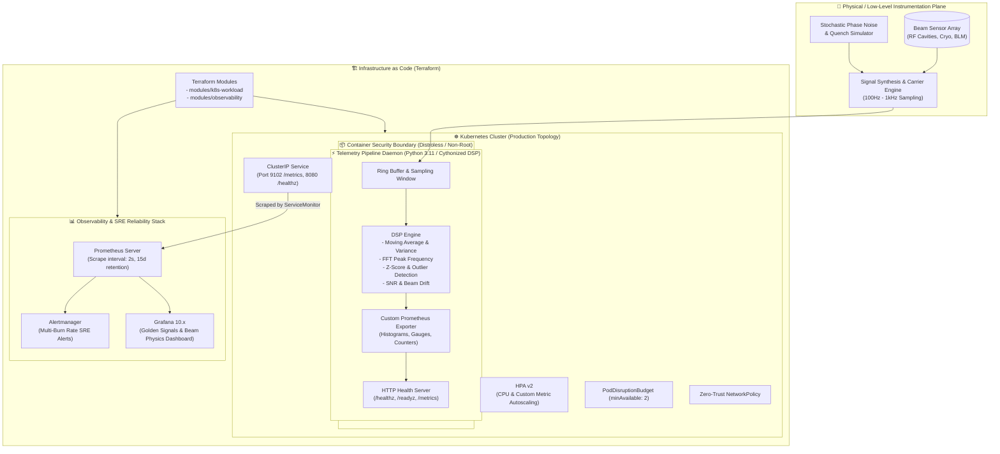

# hybrid-telemetry-observability-pipeline


> **Enterprise-grade telemetry ingestion, digital signal processing (DSP), and cloud-native observability pipeline.**  
> Designed to bridge high-throughput physical detector signal instrumentation (e.g., CERN beam loss monitors & cryogenic sensors) with modern Google SRE-style Four Golden Signals observability, automated alerting, GitOps, and Terraform Infrastructure as Code.

---

## 🏛 Architecture Overview



---

## 🎯 Key Engineering Highlights (SRE & Systems Architecture)

| Dimension | Implementation Details |
|---|---|
| **Low-Level DSP & Systems** | High-precision numeric simulation of RF cavity resonance, particle beam loss monitoring, cryogenic temperature gradients, rolling FFT/Z-Score anomaly detection. |
| **Telemetry Instrumentation** | Metric precision using `prometheus_client` with exponential bucket histograms for sub-millisecond signal processing latency, high-cardinality label controls, and lock-free thread safety. |
| **Container Hardening** | Multi-stage Docker build producing a scratch/distroless-like minimal runtime image. Non-root user (`UID 10001`), read-only root filesystem, `no-new-privileges`, all Linux capabilities dropped (`CAP_DROP ALL`). |
| **Production Kubernetes** | Zero-trust NetworkPolicy, anti-affinity topology spread, rolling updates with zero-downtime, graceful termination (`SIGTERM`), startup/liveness/readiness probes, and Horizontal Pod Autoscaling (HPA v2). |
| **Infrastructure as Code** | 100% modular Terraform architecture with clean variable encapsulation, outputs, provider constraints, and decoupled environment configurations. |
| **SRE Alerting & SLOs** | Google SRE Workbook compliant multi-window multi-burn-rate alerts (1h / 6h error budget burn rate), latency SLI thresholds ($P_{99} < 15\text{ms}$), beam quench critical alerts. |
| **Full Local Reproducibility** | One-command `docker compose up -d` bringing up the simulator, Prometheus, Grafana, and pre-provisioned dashboards. |

---

## 📂 Repository Structure

```
hybrid-telemetry-observability-pipeline/
├── .github/
│   └── workflows/
│       └── ci-cd.yml                  # Linting, Pytest, Trivy CVE scan, Docker build, K8s validation
├── docker/
│   ├── Dockerfile                     # Multi-stage security-hardened containerfile (non-root, read-only)
│   ├── .dockerignore                  # Strict context exclusion
│   └── docker-compose.yml             # Local complete stack (Pipeline + Prometheus + Grafana)
├── k8s/
│   ├── base/
│   │   ├── namespace.yaml             # Dedicated namespace
│   │   ├── configmap.yaml             # Application configuration
│   │   ├── deployment.yaml            # Hardened deployment (securityContext, probes, resources)
│   │   ├── service.yaml               # ClusterIP service
│   │   ├── service-monitor.yaml       # Prometheus Operator CRD integration
│   │   ├── hpa.yaml                   # HorizontalPodAutoscaler v2
│   │   ├── pdb.yaml                   # PodDisruptionBudget
│   │   └── networkpolicy.yaml         # Zero-trust ingress/egress restriction
│   └── kustomization.yaml             # Kustomize manifest assembler
├── terraform/
│   ├── main.tf                        # Root orchestration entrypoint
│   ├── variables.tf                   # Input variables with validation
│   ├── outputs.tf                     # Outputs (Endpoints, Service IPs)
│   ├── providers.tf                   # Provider versions and configuration
│   ├── terraform.tfvars.example       # Example variable definitions
│   └── modules/
│       ├── k8s-workload/              # Module for deploying telemetry workload
│       │   ├── main.tf
│       │   ├── variables.tf
│       │   └── outputs.tf
│       └── observability-stack/       # Module for Prometheus & Grafana stack
│           ├── main.tf
│           ├── variables.tf
│           └── outputs.tf
├── observability/
│   ├── prometheus/
│   │   ├── prometheus.yml             # Scrape config, intervals, relabeling
│   │   └── rules/
│   │       ├── alerts.yml             # SRE Multi-Burn Rate SLO alerts & physical thresholds
│   │       └── recording_rules.yml    # Precomputed metric aggregations
│   └── grafana/
│       ├── provisioning/
│       │   ├── datasources/
│       │   │   └── datasource.yml     # Automated Prometheus datasource binding
│       │   └── dashboards/
│       │       └── dashboards.yml     # Automated dashboard loader
│       └── dashboards/
│           └── hybrid-telemetry.json  # Comprehensive Grafana dashboard JSON (Golden Signals & DSP)
├── src/
│   ├── __init__.py
│   ├── config.py                      # Strongly-typed environment configuration
│   ├── signal_generator.py            # Physics & detector signal synthesis
│   ├── dsp_engine.py                  # Digital Signal Processing, rolling stats, anomaly detector
│   ├── telemetry_exporter.py          # Prometheus metrics & custom collector implementation
│   ├── health.py                      # Healthcheck HTTP server (/healthz, /readyz)
│   └── main.py                        # Lifecycle manager, signal handlers, asynchronous runner
├── tests/
│   ├── __init__.py
│   ├── test_signal_generator.py       # Signal simulation unit tests
│   ├── test_dsp_engine.py             # Anomaly detection & rolling math verification
│   ├── test_telemetry_exporter.py     # Prometheus metrics serialization tests
│   └── test_health.py                 # HTTP probe endpoints tests
├── docs/
│   ├── ARCHITECTURE.md                # In-depth architectural design document
│   ├── RUNBOOK.md                     # SRE On-Call Incident Response & Triage Runbook
│   └── SLO_SPECIFICATION.md           # SLI/SLO mathematical formulations & Error Budget policy
├── .gitignore
├── Makefile                           # Developer ergonomics (build, test, lint, run, deploy)
├── requirements.txt                   # Production dependencies
├── requirements-dev.txt               # Testing & linting tools
└── README.md
```

---

## 🚀 Quick Start Guide

### 1. Run Complete Stack Locally with Docker Compose

Spin up the telemetry engine, Prometheus, and Grafana in seconds:

```bash
cd docker
docker compose up -d --build
```

- **Telemetry Pipeline Metrics**: [http://localhost:9102/metrics](http://localhost:9102/metrics)
- **Liveness Probe**: [http://localhost:8080/healthz](http://localhost:8080/healthz)
- **Readiness Probe**: [http://localhost:8080/readyz](http://localhost:8080/readyz)
- **Prometheus UI**: [http://localhost:9090](http://localhost:9090)
- **Grafana Dashboard**: [http://localhost:3000](http://localhost:3000) (User: `admin`, Pass: `admin_sre_portfolio`)

### 2. Local Python Development & Test Execution

```bash
# Set up virtual environment
python -m venv .venv
source .venv/bin/activate  # On Windows: .venv\Scripts\activate

# Install dependencies
pip install -r requirements.txt -r requirements-dev.txt

# Run linting and static analysis
ruff check src/ tests/
mypy src/

# Run unit and integration tests with coverage
pytest --cov=src --cov-report=term-missing tests/

# Execute pipeline directly
python -m src.main
```

### 3. Deploy to Kubernetes with Kustomize

```bash
kubectl apply -k k8s/
kubectl get pods -n telemetry-system -w
```

### 4. Deploy via Terraform

```bash
cd terraform
cp terraform.tfvars.example terraform.tfvars
terraform init
terraform plan
terraform apply
```

---

## 📊 Site Reliability Engineering (SRE) Specifications

### Service Level Objectives (SLOs)

1. **Availability SLO**: $99.9\%$ of `/metrics` and `/healthz` HTTP requests return HTTP 2xx within rolling 30-day window.
   - Error Budget: $0.1\%$ ($43.8$ minutes downtime / month).
2. **Latency SLO**: $99\%$ of signal processing loops complete in $< 15\text{ms}$ ($P_{99} < 15\text{ms}$).
3. **Data Loss SLO**: $0$ undetected buffer overruns or unhandled queue overflows.

### Multi-Burn-Rate Alerting Strategy (Google SRE Standard)

| Alert Name | Severity | Consumption Rate | Window Size | Action |
|---|---|---|---|---|
| `TelemetryCriticalBurnRate` | Critical (Page) | $14.4\times$ ($2\%$ budget in 1h) | 1 hour | Immediate PagerDuty dispatch |
| `TelemetryHighBurnRate` | High (Ticket) | $6\times$ ($5\%$ budget in 6h) | 6 hours | On-call investigation |
| `CryogenicQuenchImminent` | Critical (Page) | Temperature $> 4.2\text{ K}$ | 30 seconds | Beam abort & magnet protection |
| `DSPProcessingLatencyBreached` | Warning | $P_{99} > 25\text{ms}$ | 5 minutes | Scale out pods via HPA |

---

## 🔒 Security & DevSecOps Compliance

- **Container Image**: Based on `cgr.dev/chainguard/python:latest` or hardened Alpine with stripped package managers.
- **Rootless**: Runs as unprivileged user `telemetry` (`UID: 10001`, `GID: 10001`).
- **Filesystem**: `readOnlyRootFilesystem: true` with ephemeral `/tmp` backed by `emptyDir` RAM disk (`medium: Memory`).
- **Linux Capabilities**: Dropped ALL (`drop: ["ALL"]`), `allowPrivilegeEscalation: false`.
- **Static Security Auditing**: Scanned via `bandit` and container image analyzed with `trivy` in CI/CD pipeline.

---

## 📜 License & Author

Developed by Principal Systems & Reliability Architect candidate. Open-source under the [MIT License](LICENSE).
