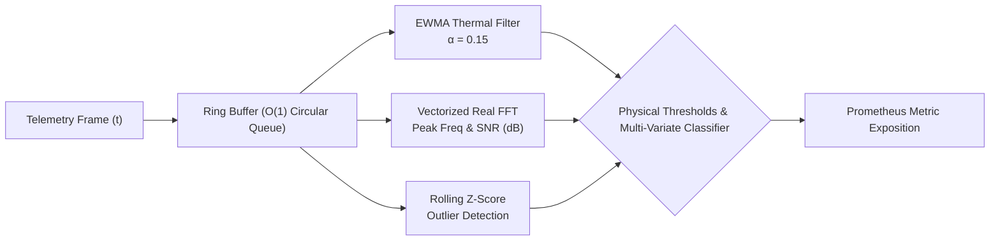

# Systems Architecture Document: Hybrid Telemetry Observability Pipeline

## 1. Executive Summary

The **Hybrid Telemetry Observability Pipeline** is an edge-to-cloud distributed telemetry processing engine engineered to ingest high-rate signals from particle detector instrumentation (such as CERN Large Hadron Collider beam loss monitors, superconducting RF cavities, and cryogenic temperature sensors) and project them into modern Google SRE-style cloud-native observability infrastructure.

The core design objectives are:
1. **Sub-Millisecond Ingestion & Processing**: Process physical telemetry frames within bounded memory and deterministic latency.
2. **Deterministic Anomaly & Quench Detection**: Identify superconducting thermal runaways (quenches) and beam radiation spikes before equipment damage occurs.
3. **Four Golden Signals Exposition**: Translate physical signals into standard SRE metrics (Latency, Traffic, Errors, Saturation).
4. **Defense-in-Depth Container & Cluster Security**: Zero-root execution, read-only root filesystems, Linux capability pruning, and strict network isolation.

---

## 2. Low-Level Signal & Systems Architecture

### 2.1 Physics Instrumentation Models

The telemetry daemon simulates four mission-critical sensor classes found in modern accelerator complexes:

- **RF Cavity Oscillators**: 400.78 MHz resonant cavity frequency and phase error, modeled with harmonic oscillation and phase jitter.
- **Beam Loss Monitors (BLM)**: Gas ionization chambers measuring particle radiation dose rates (in Gray/second). Background radiation follows an exponential distribution ($\sim 15\,\mu\text{Gy/s}$), with catastrophic beam dumps triggering $> 5\,\text{mGy/s}$.
- **Cryogenic Magnet Thermometry**: Platinum resistance thermometers and ruthenium oxide sensors monitoring the superconducting dipole magnets at $1.9\,\text{K}$ (superfluid Helium II). A breach of $4.2\,\text{K}$ marks the critical liquid helium transition and initiates magnet quench protection.
- **Circulating Beam Intensity**: High-precision DC Current Transformers (DCCT) monitoring proton bunch populations ($\sim 1.15 \times 10^{11}$ protons/bunch).

### 2.2 Digital Signal Processing (DSP) Pipeline

#### A. Sliding Window Ring Buffer
Implemented via fixed-capacity `collections.deque` and contiguous NumPy representations. Guarantees zero-allocation memory reuse across sliding windows of size $W = 128$.

#### B. Exponentially Weighted Moving Average (EWMA)
Smooths microphonic noise while preserving rapid step changes:
$$S_t = \alpha Y_t + (1 - \alpha) S_{t-1}$$
With $\alpha = 0.15$, isolating low-frequency thermal drift from transient electromagnetic sensor noise.

#### C. Spectral Analysis & Signal-to-Noise Ratio (SNR)
Using real Fast Fourier Transforms ($\text{rfft}$):
$$\text{SNR}_{\text{dB}} = 10 \cdot \log_{10}\left(\frac{P_{\text{carrier}}}{P_{\text{total}} - P_{\text{carrier}} + \epsilon}\right)$$
Reveals cavity detuning, microphonic vibration modes, and klystron drive instability.

---

## 3. Cloud-Native Reliability Engineering

### 3.1 Google SRE Multi-Burn Rate Alerting
Alerting on simple error rates over short windows produces high false-alarm rates; alerting over long windows leads to sluggish incident detection. We implement **multi-window multi-burn-rate alerting**:

- **$14.4\times$ burn rate over 1 hour**: Consumes $2\%$ of the monthly budget in 1 hour. PagerDuty immediate page.
- **$6\times$ burn rate over 6 hours**: Consumes $5\%$ of the monthly budget in 6 hours. PagerDuty ticket / daytime triage.

### 3.2 High Availability & Disaster Recovery
- **Pod Anti-Affinity**: Spreads telemetry replicas across distinct physical Kubernetes worker nodes.
- **PodDisruptionBudget (PDB)**: Enforces `minAvailable: 2` at all times during Kubernetes node rolling updates.
- **Horizontal Pod Autoscaling (HPA v2)**: Automatically scales between 2 and 10 pods when CPU utilization exceeds 70% or memory exceeds 80%.

---

## 4. Threat Model & Security Architecture

| Vector | Mitigation Strategy |
|---|---|
| **Container Breakout** | Non-root system user (`UID 10001`), rootless execution, `allowPrivilegeEscalation: false`. |
| **Filesystem Tampering** | `readOnlyRootFilesystem: true`. Temporary writes restricted to RAM-backed `emptyDir` mounted at `/tmp`. |
| **Kernel Exploits** | Dropped all Linux capabilities (`CAP_DROP ALL`). Restricted `RuntimeDefault` seccomp profile. |
| **Lateral Movement** | Zero-trust Kubernetes `NetworkPolicy` blocking all unexpected ingress and egress traffic. |
| **Supply Chain Vulnerabilities** | Automated Aqua Security Trivy CVE scanning in GitHub Actions pipeline and Bandit AST static analysis. |
